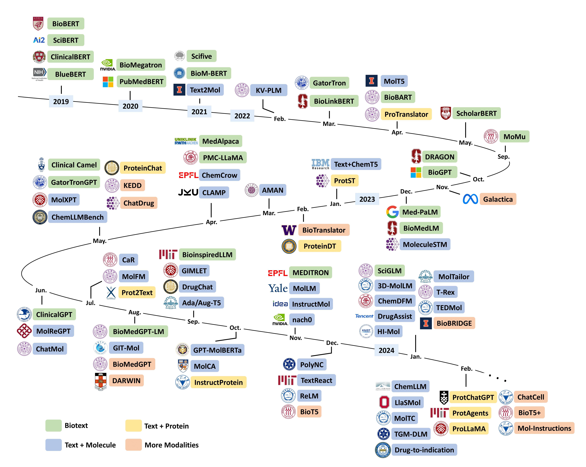

<h1 align="center">
🧬📝 Awesome Biomolecule-Language Cross Modeling
</h1>
<div align="center">

[](https://arxiv.org/abs/2403.01528)
[](https://awesome.re)   
</div>

The repository for [Leveraging Biomolecule and Natural Language through Multi-Modal Learning: A Survey](https://arxiv.org/abs/2403.01528), including related models, datasets/benchmarks, and other resource links.

🌟 **If you have a paper or resource you'd like to add, feel free to submit a pull request or open an issue.**

<p align="center">
  
</p>


## Table of Content
- [Models](#models)
  - [Biotext](#biotext)
  - [Text + Molecule](#text--molecule)
  - [Text + Protein](#text--protein)
  - [More Modalities](#more-modalities)
- [Datasets & Benchmarks](#datasets--benchmarks)
- [Related Resources](#related-resources)
  - [Related Surveys & Evaluations](#related-surveys--evaluations) 
  - [Related Repositories](#related-repositories)
- [Acknowledgements](#acknowledgements)
---

## Models
### Biotext
* **BioBERT: a pre-trained biomedical language representation model for biomedical text mining**
  
  [](https://academic.oup.com/bioinformatics/article/36/4/1234/5566506)
  
  [](https://github.com/dmis-lab/biobert)
  [](https://huggingface.co/dmis-lab)

* **SciBERT: A Pretrained Language Model for Scientific Text**
  
  [](https://aclanthology.org/D19-1371.pdf)
  
  [](https://github.com/allenai/scibert)
  [](https://github.com/allenai/scibert)

* **(BlueBERT) Transfer Learning in Biomedical Natural Language Processing: An Evaluation of BERT and ELMo on Ten Benchmarking Datasets**
  
  [](https://aclanthology.org/W19-5006.pdf)
  
  [](https://github.com/ncbi-nlp/bluebert)
  [](https://huggingface.co/bionlp)

* **Bio-Megatron: Larger Biomedical Domain Language Model**
  
  [](https://aclanthology.org/2020.emnlp-main.379.pdf)
  
  [](https://github.com/NVIDIA/NeMo)

* **ClinicalBERT: Modeling Clinical Notes and Predicting Hospital Readmission**
  
  [](https://arxiv.org/pdf/1904.05342.pdf)
  
  [](https://github.com/kexinhuang12345/clinicalBERT)
  [](https://github.com/lindvalllab/clinicalXLNet)

* **BioM-Transformers: Building Large Biomedical Language Models with BERT, ALBERT and ELECTRA**
  
  [](https://aclanthology.org/2021.bionlp-1.24.pdf)
  
  [](https://github.com/salrowili/BioM-Transformers)
  [](https://huggingface.co/sultan)

* **(PubMedBERT) Domain-Specific Language Model Pretraining for Biomedical Natural Language Processing**
  
  [](https://dl.acm.org/doi/10.1145/3458754)
  
  [](https://huggingface.co/microsoft/BiomedNLP-BiomedBERT-base-uncased-abstract-fulltext)

* **SciFive: a text-to-text transformer model for biomedical literature**
  
  [](https://arxiv.org/pdf/2106.03598.pdf)
  
  [](https://github.com/justinphan3110/SciFive)
  [](https://huggingface.co/razent)

* **(DRAGON) Deep Bidirectional Language-Knowledge Graph Pretraining**
  
  [](https://arxiv.org/pdf/2210.09338.pdf)
  
  [](https://github.com/michiyasunaga/dragon)
  [](https://github.com/michiyasunaga/dragon)

* **LinkBERT: Pretraining Language Models with Document Links**
  
  [](https://aclanthology.org/2022.acl-long.551.pdf)
  
  [](https://github.com/michiyasunaga/LinkBERT)
  [](https://huggingface.co/michiyasunaga)

* **BioBART: Pretraining and Evaluation of A Biomedical Generative Language Model**
  
  [](https://aclanthology.org/2022.bionlp-1.9.pdf)
  
  [](https://github.com/GanjinZero/BioBART)
  [](https://huggingface.co/GanjinZero)

* **BioGPT: Generative Pre-trained Transformer for Biomedical Text Generation and Mining**
  
  [](https://doi.org/10.1093/bib/bbac409)
  
  [](https://github.com/microsoft/BioGPT)
  [](https://huggingface.co/microsoft/biogpt)

* **GatorTron: A Large Clinical Language Model to Unlock Patient Information from Unstructured Electronic Health Records**
  
  [](https://arxiv.org/pdf/2203.03540.pdf)
  
  [](https://github.com/NVIDIA/Megatron-LM)

* **Large language models encode clinical knowledge**
  
  [](https://www.nature.com/articles/s41586-023-06291-2.pdf)
  

* **(ScholarBERT) The Diminishing Returns of Masked Language Models to Science**
  
  [](https://aclanthology.org/2023.findings-acl.82.pdf)
  
  [](https://huggingface.co/globuslabs/ScholarBERT)

* **PMC-LLaMA: Further Finetuning LLaMA on Medical Papers**
  
  [](https://arxiv.org/pdf/2304.14454.pdf)
  
  [](https://github.com/chaoyi-wu/PMC-LLaMA)
  [](https://github.com/chaoyi-wu/PMC-LLaMA)


* **BioMedGPT: Open Multimodal Generative Pre-trained Transformer for BioMedicine**
  
  [](https://arxiv.org/pdf/2308.09442v2.pdf)
  
  [](https://github.com/PharMolix/OpenBioMed)
  [](https://huggingface.co/PharMolix/BioMedGPT-LM-7B)

* **(GatortronGPT) A study of generative large language model for medical research and healthcare**
  
  [](https://arxiv.org/pdf/2305.13523.pdf)
  
  [](https://github.com/NVIDIA/Megatron-LM)

* **Clinical Camel: An Open-Source Expert-Level Medical Language Model with Dialogue-Based Knowledge Encoding**
  
  [](https://arxiv.org/pdf/2305.12031.pdf)
  
  [](https://github.com/bowang-lab/clinical-camel)
  [](https://huggingface.co/wanglab/ClinicalCamel-70B)

* **MEDITRON-70B: Scaling Medical Pretraining for Large Language Models**
  
  [](https://arxiv.org/pdf/2311.16079.pdf)
  
  [](https://github.com/epfLLM/meditron)
  [](https://huggingface.co/epfl-llm/meditron-70b)

* **BioinspiredLLM: Conversational Large Language Model for the Mechanics of Biological and Bio-inspired Materials**
  
  [](https://arxiv.org/pdf/2309.08788.pdf)
  
  [](https://huggingface.co/lamm-mit/BioinspiredLLM)

* **ClinicalGPT: Large Language Models Finetuned with Diverse Medical Data and Comprehensive Evaluation**
  
  [](https://arxiv.org/pdf/2306.09968.pdf)
  
  [](https://huggingface.co/medicalai/ClinicalGPT-base-zh)

* **MedAlpaca - An Open-Source Collection of Medical Conversational AI Models and Training Data**
  
  [](https://arxiv.org/pdf/2304.08247.pdf)
  
  [](https://github.com/kbressem/medAlpaca)
  [](https://huggingface.co/medalpaca)

* **SciGLM: Training Scientific Language Models with Self-Reflective Instruction Annotation and Tuning**
  
  [](https://arxiv.org/pdf/2401.07950.pdf)
  
  [](https://github.com/THUDM/SciGLM)
  [](https://huggingface.co/zd21/SciGLM-6B)

* **BioMedLM**
  
  [](https://crfm.stanford.edu/2022/12/15/biomedlm.html)
  [](https://github.com/stanford-crfm/BioMedLM)
  [](https://huggingface.co/stanford-crfm/BioMedLM)


### Text + Molecule
* **Text2Mol: Cross-Modal Molecule Retrieval with Natural Language Queries**
  
  [](https://aclanthology.org/2021.emnlp-main.47.pdf)
  
  [](https://github.com/cnedwards/text2mol)
  

* **(MolT5) Translation between Molecules and Natural Language**  
  
  [](https://aclanthology.org/2022.emnlp-main.26.pdf)
  
  [](https://github.com/blender-nlp/MolT5)
  [](https://huggingface.co/laituan245)

* **(KV-PLM) A deep-learning system bridging molecule structure and biomedical text with comprehension comparable to human professionals**
  
  [](https://www.nature.com/articles/s41467-022-28494-3.pdf)
  
  [](https://github.com/thunlp/KV-PLM)
  [](https://drive.google.com/drive/folders/1xig3-3JG63kR-Xqj1b9wkPEdxtfD_4IX)

* **(MoMu) A Molecular Multimodal Foundation Model Associating Molecule Graphs with Natural Language**
  
  [](https://arxiv.org/pdf/2209.05481.pdf)
  
  [](https://github.com/BingSu12/MoMu)
  [](https://github.com/BingSu12/MoMu)

* **(Text+Chem T5) Unifying Molecular and Textual Representations via Multi-task Language Modelling**
  
  [](https://proceedings.mlr.press/v202/christofidellis23a/christofidellis23a.pdf)
  
  [](https://github.com/GT4SD/multitask_text_and_chemistry_t5)
  [](https://huggingface.co/GT4SD)

* **(CLAMP) Enhancing Activity Prediction Models in Drug Discovery with the Ability to Understand Human Language**
  
  [](https://proceedings.mlr.press/v202/seidl23a/seidl23a.pdf)
  
  [](https://github.com/ml-jku/clamp)
  [](https://github.com/ml-jku/clamp)

* **GIMLET: A Unified Graph-Text Model for Instruction-Based Molecule Zero-Shot Learning**
  
  [](https://openreview.net/pdf?id=Tt6DrRCgJV)
  
  [](https://github.com/zhao-ht/GIMLET)
  [](https://huggingface.co/haitengzhao/gimlet)

* **(HI-Mol) Data-Efficient Molecular Generation with Hierarchical Textual Inversion**
  
  [](https://openreview.net/pdf?id=wwotGBxtC3)

* **MoleculeGPT: Instruction Following Large Language Models for Molecular Property Prediction**
  
  [](https://ai4d3.github.io/papers/34.pdf)

* **(ChemLLMBench) What indeed can GPT models do in chemistry? A comprehensive benchmark on eight tasks**
  
  [](https://openreview.net/pdf?id=1ngbR3SZHW)
  
  [](https://github.com/ChemFoundationModels/ChemLLMBench)

* **MolXPT: Wrapping Molecules with Text for Generative Pre-training**
  
  [](https://aclanthology.org/2023.acl-short.138.pdf)
  

* **(TextReact) Predictive Chemistry Augmented with Text Retrieval**
  
  [](https://aclanthology.org/2023.emnlp-main.784.pdf)
  
  [](https://github.com/thomas0809/textreact)

* **MolCA: Molecular Graph-Language Modeling with Cross-Modal Projector and Uni-Modal Adapter**
  
  [](https://aclanthology.org/2023.emnlp-main.966v2.pdf)
  
  [](https://github.com/eltociear/MolCA)
  [](https://ufile.io/6vffm5bg)

* **ReLM: Leveraging Language Models for Enhanced Chemical Reaction Prediction**
  
  [](https://aclanthology.org/2023.findings-emnlp.366.pdf)
  
  [](https://github.com/syr-cn/ReLM)

* **(MoleculeSTM) Multi-modal Molecule Structure-text Model for Text-based Retrieval and Editing**
  
  [](https://www.nature.com/articles/s42256-023-00759-6.pdf)
  
  [](https://github.com/chao1224/MoleculeSTM)
  [](https://huggingface.co/chao1224/MoleculeSTM)

* **(AMAN) Adversarial Modality Alignment Network for Cross-Modal Molecule Retrieval**
  
  [](https://ieeexplore.ieee.org/document/10063974)
  
  [](https://github.com/NicoleBonnie/AMAN)

* **MolLM: A Unified Language Model for Integrating Biomedical Text with 2D and 3D Molecular Representations**
  
  [](https://www.biorxiv.org/content/10.1101/2023.11.25.568656v2.full.pdf)
  
  [](https://github.com/gersteinlab/MolLM)
  [](https://drive.google.com/drive/folders/17XhqdsDOxiT8PEDLHdsLPKf62PXPmbms)

* **(MolReGPT) Empowering Molecule Discovery for Molecule-Caption Translation with Large Language Models: A ChatGPT Perspective**
  
  [](https://arxiv.org/pdf/2306.06615.pdf)
  
  [](https://github.com/phenixace/MolReGPT)

* **(CaR) Can Large Language Models Empower Molecular Property Prediction?**
  
  [](https://arxiv.org/pdf/2307.07443.pdf)
  
  [](https://github.com/ChnQ/LLM4Mol)

* **MolFM: A Multimodal Molecular Foundation Model**
  
  [](https://arxiv.org/pdf/2307.09484.pdf)
  
  [](https://github.com/PharMolix/OpenBioMed)
  [](https://pan.baidu.com/share/init?surl=iAMBkuoZnNAylhopP5OgEg\&pwd=7a6b)

* **(ChatMol) Interactive Molecular Discovery with Natural Language**
  
  [](https://arxiv.org/pdf/2306.11976.pdf)
  
  [](https://github.com/Ellenzzn/ChatMol)
  [](https://drive.google.com/drive/folders/1I-LcBE0emj8p1W6WFCbEYajTADGN1RuC)

* **InstructMol: Multi-Modal Integration for Building a Versatile and Reliable Molecular Assistant in Drug Discovery**
  
  [](https://arxiv.org/pdf/2311.16208.pdf)
  
  [](https://github.com/IDEA-XL/InstructMol)

* **ChemCrow: Augmenting large-language models with chemistry tools**
  
  [](https://arxiv.org/pdf/2304.05376.pdf)
  
  [](https://github.com/ur-whitelab/chemcrow-public)

* **GPT-MolBERTa: GPT Molecular Features Language Model for molecular property prediction**
  
  [](https://arxiv.org/pdf/2310.03030.pdf)
  
  [](https://github.com/Suryanarayanan-Balaji/GPT-MolBERTa)

* **nach0: Multimodal Natural and Chemical Languages Foundation Model**
  
  [](https://arxiv.org/pdf/2311.12410.pdf)
  

* **DrugChat: Towards Enabling ChatGPT-Like Capabilities on Drug Molecule Graphs**
  
  [](https://arxiv.org/pdf/2309.03907.pdf)
  
  [](https://github.com/UCSD-AI4H/drugchat)

* **(Ada/Aug-T5) From Artificially Real to Real: Leveraging Pseudo Data from Large Language Models for Low-Resource Molecule Discovery**
  
  [](https://arxiv.org/pdf/2309.05203.pdf)
  
  [](https://github.com/SCIR-HI/ArtificiallyR2R)
  [](https://huggingface.co/SCIR-HI)

* **MolTailor: Tailoring Chemical Molecular Representation to Specific Tasks via Text Prompts**
  
  [](https://arxiv.org/pdf/2401.11403.pdf)
  
  [](https://github.com/SCIR-HI/MolTailor)

* **(TGM-DLM) Text-Guided Molecule Generation with Diffusion Language Model**
  
  [](https://arxiv.org/pdf/2402.13040.pdf)
  
  [](https://github.com/Deno-V/tgm-dlm)

* **GIT-Mol: A Multi-modal Large Language Model for Molecular Science with Graph, Image, and Text**
  
  [](https://doi.org/10.1016/j.compbiomed.2024.108073)
  
  [](https://github.com/ai-hpc-research-team/git-mol)

* **PolyNC: a natural and chemical language model for the prediction of unified polymer properties**
  
  [](https://pubs.rsc.org/en/content/articlepdf/2024/sc/d3sc05079c)
  
  [](https://github.com/HKQiu/Unified_ML4Polymers)
  [](https://huggingface.co/hkqiu/PolyNC)

* **MolTC: Towards Molecular Relational Modeling In Language Models**
  
  [](https://arxiv.org/pdf/2402.03781.pdf)
  
  [](https://github.com/MangoKiller/MolTC)

* **T-Rex: Text-assisted Retrosynthesis Prediction**
  
  [](https://arxiv.org/pdf/2401.14637.pdf)
  
  [](https://github.com/lauyikfung/T-Rex)

* **LlaSMol: Advancing Large Language Models for Chemistry with a Large-Scale, Comprehensive, High-Quality Instruction Tuning Dataset**
  
  [](https://arxiv.org/pdf/2402.09391.pdf)
  
  [](https://github.com/OSU-NLP-Group/LLM4Chem)
  [](https://huggingface.co/osunlp/LLM4Chem)

* **(Drug-to-indication) Emerging Opportunities of Using Large Language Models for Translation Between Drug Molecules and Indications**
  
  [](https://arxiv.org/pdf/2402.09588.pdf)
  
  [](https://github.com/PittNAIL/drug-to-indication)

* **ChemDFM: Dialogue Foundation Model for Chemistry**
  
  [](https://arxiv.org/pdf/2401.14818.pdf)
  

* **DrugAssist: A Large Language Model for Molecule Optimization**
  
  [](https://arxiv.org/pdf/2401.10334.pdf)
  
  [](https://github.com/blazerye/DrugAssist)

* **ChemLLM: A Chemical Large Language Model**
  
  [](https://arxiv.org/pdf/2402.06852.pdf)
  
  [](https://huggingface.co/AI4Chem/ChemLLM-7B-Chat)

* **(TEDMol) Text-guided Diffusion Model for 3D Molecule Generation**
  
  [](https://openreview.net/pdf?id=FdUloEgBSE)

* **(3DToMolo) Sculpting Molecules in 3D: A Flexible Substructure Aware Framework for Text-Oriented Molecular Optimization**

  [](https://arxiv.org/pdf/2403.03425.pdf)
  

* **(ICMA) Large Language Models are In-Context Molecule Learners**

  [](https://arxiv.org/pdf/2403.04197.pdf)
  

* **Benchmarking Large Language Models for Molecule Prediction Tasks**

  [](https://arxiv.org/pdf/2403.05075.pdf)
  
  [](https://github.com/zhiqiangzhongddu/LLMaMol)

* **DRAK: Unlocking Molecular Insights with Domain-Specific Retrieval-Augmented Knowledge in LLMs**

  [](https://www.researchgate.net/profile/Jinzhe-Liu-2/publication/378683833_DRAK_Unlocking_Molecular_Insights_with_Domain-Specific_Retrieval-Augmented_Knowledge_in_LLMs/links/65e43d34adf2362b63683086/DRAK-Unlocking-Molecular-Insights-with-Domain-Specific-Retrieval-Augmented-Knowledge-in-LLMs.pdf)
  

* **3M-Diffusion: Latent Multi-Modal Diffusion for Text-Guided Generation of Molecular Graphs**
  
  [](https://arxiv.org/pdf/2403.07179.pdf)
  
  [](https://github.com/huaishengzhu/3MDiffusion)

* **(TSMMG) Instruction Multi-Constraint Molecular Generation Using a Teacher-Student Large Language Model**

  [](https://arxiv.org/pdf/2403.13244.pdf)
  [](https://github.com/HHW-zhou/TSMMG)


### Text + Protein
* **OntoProtein: Protein Pretraining With Gene Ontology Embedding**
  
  [](https://openreview.net/pdf?id=yfe1VMYAXa4)
  
  [](https://github.com/zjunlp/OntoProtein)
  [](https://huggingface.co/zjunlp/OntoProtein)

* **ProTranslator: Zero-Shot Protein Function Prediction Using Textual Description**
  
  [](https://arxiv.org/abs/2204.10286)
  
  [](https://github.com/HanwenXuTHU/ProTranslator)

* **ProtST: Multi-Modality Learning of Protein Sequences and Biomedical Texts**
  
  [](https://proceedings.mlr.press/v202/xu23t/xu23t.pdf)
  
  [](https://github.com/DeepGraphLearning/ProtST)
  [](https://github.com/DeepGraphLearning/ProtST)

* **InstructProtein: Aligning Human and Protein Language via Knowledge Instruction**
  
  [](https://arxiv.org/pdf/2310.03269.pdf)
  

* **(ProteinDT) A Text-guided Protein Design Framework**
  
  [](https://arxiv.org/pdf/2302.04611.pdf)
  

* **ProteinChat: Towards Achieving ChatGPT-Like Functionalities on Protein 3D Structures**
  
  [](https://www.techrxiv.org/doi/full/10.36227/techrxiv.23120606.v1)
  [](https://github.com/UCSD-AI4H/proteinchat)

* **Prot2Text: Multimodal Protein's Function Generation with GNNs and Transformers**
  
  [](https://arxiv.org/pdf/2307.14367.pdf)
  
  [](https://github.com/hadi-abdine/Prot2Text)
  [](https://github.com/hadi-abdine/Prot2Text)
  
* **ProtChatGPT: Towards Understanding Proteins with Large Language Models**
  
  [](https://arxiv.org/pdf/2402.09649.pdf)
  

* **ProtAgents: Protein discovery via large language model multi-agent collaborations combining physics and machine learning**
  
  [](https://arxiv.org/pdf/2402.04268.pdf)
  
  [](https://github.com/lamm-mit/ProtAgents)

* **ProLLaMA: A Protein Large Language Model for Multi-Task Protein Language Processing**
  
  [](https://arxiv.org/pdf/2402.16445v1.pdf)
  
  [](https://github.com/Lyu6PosHao/ProLLaMA)
  [](https://huggingface.co/GreatCaptainNemo/ProLLaMA)

* **ProtLLM: An Interleaved Protein-Language LLM with Protein-as-Word Pre-Training**
  
  [](https://arxiv.org/pdf/2403.07920.pdf)
  
  [](https://github.com/ProtLLM/ProtLLM)
  [](https://huggingface.co/datasets/ProtLLM/ProtLLM)


### More Modalities

* **Galactica: A Large Language Model for Science**
  
  [](https://galactica.org/static/paper.pdf)
  
  [](https://github.com/paperswithcode/galai)
  [](https://huggingface.co/models?other=galactica)

* **BioT5: Enriching Cross-modal Integration in Biology with Chemical Knowledge and Natural Language Associations**
  
  [](https://aclanthology.org/2023.emnlp-main.70.pdf)
  
  [](https://github.com/QizhiPei/BioT5)
  [](https://huggingface.co/QizhiPei/biot5-base)

* **DARWIN Series: Domain Specific Large Language Models for Natural Science**
  
  [](https://arxiv.org/pdf/2308.13565.pdf)
  
  [](https://github.com/MasterAI-EAM/Darwin)
  [](https://github.com/MasterAI-EAM/Darwin)

* **BioMedGPT: Open Multimodal Generative Pre-trained Transformer for BioMedicine**
  
  [](https://arxiv.org/pdf/2308.09442.pdf)
  
  [](https://github.com/PharMolix/OpenBioMed)
  [](https://pan.baidu.com/share/init?surl=iAMBkuoZnNAylhopP5OgEg\&pwd=7a6b)

* **(StructChem) Structured Chemistry Reasoning with Large Language Models**
  
  [](https://arxiv.org/pdf/2311.09656.pdf)
  
  [](https://github.com/ozyyshr/StructChem?tab=readme-ov-file)

* **(BioTranslator) Multilingual translation for zero-shot biomedical classification using BioTranslator**
  
  [](https://www.nature.com/articles/s41467-023-36476-2.pdf)
  
  [](https://github.com/HanwenXuTHU/BioTranslatorProject)
  [](https://figshare.com/articles/dataset/Protein_Pathway_data_tar/20120447)

* **Mol-Instructions: A Large-Scale Biomolecular Instruction Dataset for Large Language Models**
  
  [](https://openreview.net/pdf?id=Tlsdsb6l9n)
  
  [](https://github.com/zjunlp/Mol-Instructions)
  [](https://huggingface.co/zjunlp)

* **(ChatDrug) ChatGPT-powered Conversational Drug Editing Using Retrieval and Domain Feedback**
  
  [](https://openreview.net/pdf?id=yRrPfKyJQ2)
  
  [](https://github.com/chao1224/ChatDrug)

* **BioBridge: Bridging Biomedical Foundation Models via Knowledge Graphs**
  
  [](https://openreview.net/pdf?id=jJCeMiwHdH)
  
  [](https://github.com/RyanWangZf/BioBridge)
  [](https://github.com/RyanWangZf/BioBridge/tree/main/checkpoints)

* **(KEDD) Towards Unified AI Drug Discovery with Multiple Knowledge Modalities**
  
  [](https://arxiv.org/pdf/2305.01523.pdf)
  

* **ChatCell: Facilitating Single-Cell Analysis with Natural Language**
  
  [](https://arxiv.org/pdf/2402.08303v2.pdf)
  
  [](https://github.com/zjunlp/ChatCell)
  [](https://huggingface.co/zjunlp)

* **BioT5+: Towards Generalized Biological Understanding with IUPAC Integration and Multi-task Tuning**
  
  [](https://arxiv.org/pdf/2402.17810.pdf)
  
  [](https://github.com/QizhiPei/BioT5)
  [](https://github.com/QizhiPei/BioT5)

* **MolBind: Multimodal Alignment of Language, Molecules, and Proteins**
  
  [](https://arxiv.org/pdf/2403.08167.pdf)
  
  [](https://github.com/tengxiao1/MolBind)

* **Uni-SMART: Universal Science Multimodal Analysis and Research Transformer**
  
  [](https://arxiv.org/pdf/2403.10301.pdf)
  

* **Tag-LLM: Repurposing General-Purpose LLMs for Specialized Domains**
  
  [](https://arxiv.org/pdf/2402.05140.pdf)
  
  [](https://github.com/sjunhongshen/Tag-LLM)

* **An Evaluation of Large Language Models in Bioinformatics Research**
  
  [](https://arxiv.org/pdf/2402.13714.pdf)
  


## Datasets & Benchmarks
| **Dataset**          | **Usage**         | **Modality**            | **Link**                                                             |
|----------------------|-------------------|-------------------------|----------------------------------------------------------------------|
| PubMed               | Pre-training      | Text                    | [https://pubmed.ncbi.nlm.nih.gov/download](https://pubmed.ncbi.nlm.nih.gov/download) |
| bioRxiv              | Pre-training      | Text                    | [https://huggingface.co/datasets/mteb/raw_biorxiv](https://huggingface.co/datasets/mteb/raw_biorxiv),[https://www.biorxiv.org/tdm](https://www.biorxiv.org/tdm) |
| MedRxiv              | Pre-training      | Text                    | [https://www.medrxiv.org/tdm](https://www.medrxiv.org/tdm)           |
| S2ORC                | Pre-training      | Text                    | [https://github.com/allenai/s2orc](https://github.com/allenai/s2orc) |
| MIMIC                | Pre-training      | Text                    | [https://physionet.org/content/mimiciii/1.4](https://physionet.org/content/mimiciii/1.4) |
| UF Health            | Pre-training      | Text                    | [https://idr.ufhealth.org](https://idr.ufhealth.org)                 |
| Elsevier Corpus      | Pre-training      | Text                    | [https://elsevier.digitalcommonsdata.com/datasets/zm33cdndxs/3](https://elsevier.digitalcommonsdata.com/datasets/zm33cdndxs/3) |
| Eurpoe PMC           | Pre-training      | Text                    | [https://europepmc.org/downloads](https://europepmc.org/downloads)   |
| LibreText            | Pre-training      | Text                    | [https://chem.libretexts.org](https://chem.libretexts.org/)          |
| NLM literature archive | Pre-training    | Text                    | [https://ftp.ncbi.nlm.nih.gov/pub/litarch/](https://ftp.ncbi.nlm.nih.gov/pub/litarch/) |
| GAP-Replay           | Pre-training      | Text                    | -                                                                    |
| ZINC                 | Pre-training      | Molecule                | [https://zinc15.docking.org](https://zinc15.docking.org), [https://zinc20.docking.org](https://zinc20.docking.org) |
| UniProt              | Pre-training      | Protein                 | [https://www.uniprot.org](https://www.uniprot.org)                   |
| ChEMBL               | Pre-training      | Molecule, Bioassay      | [https://www.ebi.ac.uk/chembl](https://www.ebi.ac.uk/chembl)         |
| GIMLET               | Pre-training      | Molecule, Bioassay      | [https://github.com/zhao-ht/GIMLET](https://github.com/zhao-ht/GIMLET), [https://huggingface.co/datasets/haitengzhao/molecule_property_instruction](https://huggingface.co/datasets/haitengzhao/molecule_property_instruction) |
| PubChem              | Pre-training      | Text, Molecule, IUPAC, etc | [https://ftp.ncbi.nlm.nih.gov/pubchem](https://ftp.ncbi.nlm.nih.gov/pubchem) |
| InterPT              | Pre-training      | Text, Protein           | [https://huggingface.co/datasets/ProtLLM/ProtLLM](https://huggingface.co/datasets/ProtLLM/ProtLLM) |
| STRING               | Pre-training      | Text, Protein, etc      | [https://string-db.org](https://string-db.org)                       |
| BLURB                | Fine-tuning       | Text                    | [https://microsoft.github.io/BLURB](https://microsoft.github.io/BLURB) |
| PubMedQA             | Fine-tuning       | Text                    | [https://github.com/pubmedqa/pubmedqa](https://github.com/pubmedqa/pubmedqa) |
| SciQ                 | Fine-tuning       | Text                    | [https://huggingface.co/datasets/sciq](https://huggingface.co/datasets/sciq) |
| BioASQ               | Fine-tuning       | Text                    | [http://participants-area.bioasq.org/datasets](http://participants-area.bioasq.org/datasets) |
| MoleculeNet          | Fine-tuning       | Molecule                | [https://moleculenet.org/datasets-1](https://moleculenet.org/datasets-1) |
| MoleculeACE          | Fine-tuning       | Molecule                | [https://github.com/molML/MoleculeACE](https://github.com/molML/MoleculeACE) |
| TDC                  | Fine-tuning       | Molecule                | [https://tdcommons.ai/](https://tdcommons.ai/)                        |
| USPTO                | Fine-tuning       | Molecule                | [https://yzhang.hpc.nyu.edu/T5Chem](https://yzhang.hpc.nyu.edu/T5Chem) |
| Graph2graph          | Fine-tuning       | Molecule                | [https://github.com/wengong-jin/iclr19-graph2graph/tree/master/data](https://github.com/wengong-jin/iclr19-graph2graph/tree/master/data) |
| PEER                 | Fine-tuning       | Protein                 | [https://github.com/DeepGraphLearning/PEER_Benchmark](https://github.com/DeepGraphLearning/PEER_Benchmark) |
| FLIP                 | Fine-tuning       | Protein                 | [https://benchmark.protein.properties](https://benchmark.protein.properties) |
| TAPE                 | Fine-tuning       | Protein                 | [https://github.com/songlab-cal/tape](https://github.com/songlab-cal/tape) |
| PubChemSTM           | Fine-tuning       | Text, Molecule          | [https://huggingface.co/datasets/chao1224/MoleculeSTM/tree/main](https://huggingface.co/datasets/chao1224/MoleculeSTM/tree/main) |
| PseudoMD-1M          | Fine-tuning       | Text, Molecule          | [https://huggingface.co/datasets/SCIR-HI/PseudoMD-1M](https://huggingface.co/datasets/SCIR-HI/PseudoMD-1M) |
| ChEBI-20             | Fine-tuning       | Text, Molecule          | [https://github.com/blender-nlp/MolT5](https://github.com/blender-nlp/MolT5)|
| ChEBI-20-MM          | Fine-tuning       | Text, Molecule          | [https://github.com/AI-HPC-Research-Team/SLM4Mol](https://github.com/AI-HPC-Research-Team/SLM4Mol) |
| ChEBL-dia            | Fine-tuning       | Text, Molecule          | [https://github.com/Ellenzzn/ChatMol/tree/main/data/ChEBI-dia](https://github.com/Ellenzzn/ChatMol/tree/main/data/ChEBI-dia) |
| L+M-24               | Fine-tuning       | Text, Molecule          | [https://github.com/language-plus-molecules/LPM-24-Dataset](https://github.com/language-plus-molecules/LPM-24-Dataset) |
| PCdes                | Fine-tuning       | Text, Molecule          | [https://github.com/thunlp/KV-PLM](https://github.com/thunlp/KV-PLM)|
| MoMu                 | Fine-tuning       | Text, Molecule          | [https://github.com/yangzhao1230/GraphTextRetrieval](https://github.com/yangzhao1230/GraphTextRetrieval) |
| PubChemQA            | Fine-tuning       | Text, Molecule          | [https://github.com/PharMolix/OpenBioMed](https://github.com/PharMolix/OpenBioMed) |
| 3D-MolT              | Fine-tuning       | Text, Molecule          | [https://huggingface.co/datasets/Sihangli/3D-MoIT](https://huggingface.co/datasets/Sihangli/3D-MoIT) |
| MoleculeQA           | Fine-tuning       | Text, Molecule          | [https://github.com/IDEA-XL/MoleculeQA](https://github.com/IDEA-XL/MoleculeQA) |
| DrugBank             | Fine-tuning       | Text, Molecule, etc     | [https://github.com/SCIR-HI/ArtificiallyR2R](https://github.com/SCIR-HI/ArtificiallyR2R)|
| SwissProt            | Fine-tuning       | Text, Protein           | [https://www.expasy.org/resources/uniprotkb-swiss-prot](https://www.expasy.org/resources/uniprotkb-swiss-prot)|
| UniProtQA            | Fine-tuning       | Text, Protein           | [https://github.com/PharMolix/OpenBioMed](https://github.com/PharMolix/OpenBioMed) |
| SciEval              | Instruction       | Text                    | [https://github.com/OpenDFM/SciEval](https://github.com/OpenDFM/SciEval) |
| BioInfo-Bench        | Instruction       | Text                    | [https://github.com/cinnnna/bioinfo-bench](https://github.com/cinnnna/bioinfo-bench) |
| MedC-I               | Instruction       | Text                    | [https://huggingface.co/datasets/axiong/pmc_llama_instructions](https://huggingface.co/datasets/axiong/pmc_llama_instructions) |
| BioMedEval           | Instruction       | Text                    | [https://github.com/tahmedge/llm-eval-biomed](https://github.com/tahmedge/llm-eval-biomed) |
| MolOpt-Instructions  | Instruction       | Text, Molecule          | [https://github.com/blazerye/DrugAssist](https://github.com/blazerye/DrugAssist) |
| SMolInstruct         | Instruction       | Text, Molecule          | [https://github.com/OSU-NLP-Group/LLM4Chem](https://github.com/OSU-NLP-Group/LLM4Chem) |
| ChemLLMBench         | Instruction       | Text, Molecule          | [https://github.com/ChemFoundationModels/ChemLLMBench](https://github.com/ChemFoundationModels/ChemLLMBench) |
| AI4Chem              | Instruction       | Text, Molecule          | [https://github.com/andresilvapimentel/AI4Chem](https://github.com/andresilvapimentel/AI4Chem) |
| GPTChem              | Instruction       | Text, Molecule          | [https://github.com/kjappelbaum/gptchem](https://github.com/kjappelbaum/gptchem)|
| DARWIN               | Instruction       | Text, Molecule, etc     | [https://github.com/MasterAI-EAM/Darwin/tree/main/dataset](https://github.com/MasterAI-EAM/Darwin/tree/main/dataset) |
| StructChem           | Instruction       | Text, Molecule, etc     | [https://github.com/ozyyshr/StructChem](https://github.com/ozyyshr/StructChem) |
| SciAssess            | Instruction       | Text, Molecule, etc     | [https://sci-assess.github.io](https://sci-assess.github.io/), [https://github.com/sci-assess/SciAssess](https://github.com/sci-assess/SciAssess) |
| InstructProtein      | Instruction       | Text, Protein           | - |
| Open Protein Instructions | Instruction | Text, Protein          | [https://github.com/baaihealth/opi](https://github.com/baaihealth/opi) |
| Mol-Instructions     | Instruction       | Text, Molecule, Protein | [https://huggingface.co/datasets/zjunlp/Mol-Instructions](https://huggingface.co/datasets/zjunlp/Mol-Instructions) |
| CheF                 | -                 | Text, Molecule          | [https://github.com/kosonocky/CheF](https://github.com/kosonocky/CheF) |
| IUPAC Gold Book      | -                 | Text, Molecule          | [https://goldbook.iupac.org](https://goldbook.iupac.org/) |
| ChemNLP              | -                 | Text, Molecule, etc     | [https://github.com/OpenBioML/chemnlp](https://github.com/OpenBioML/chemnlp) |
| ChemFOnt             | -                 | Text, Molecule, Protein, etc | [https://www.chemfont.ca](https://www.chemfont.ca)|


## Related Resources
### Related Surveys & Evaluations
* Bridging Text and Molecule: A Survey on Multimodal Frameworks for Molecule [Arxiv 2403](https://arxiv.org/abs/2403.13830)
* From Words to Molecules: A Survey of Large Language Models in Chemistry [Arxiv 2402](https://arxiv.org/abs/2402.01439)
* Scientific Language Modeling: A Quantitative Review of Large Language Models in Molecular Science [Arxiv 2402](https://arxiv.org/abs/2402.04119)
* Scientific Large Language Models: A Survey on Biological & Chemical Domains [Arxiv 2401](https://arxiv.org/abs/2401.14656)
* The Impact of Large Language Models on Scientific Discovery: a Preliminary Study using GPT-4 [Arxiv 2311](https://arxiv.org/abs/2311.07361)
* Transformers and Large Language Models for Chemistry and Drug Discovery [Arxiv 2310](https://arxiv.org/abs/2310.06083)
* Language models in molecular discovery [Arxiv 2309](https://arxiv.org/abs/2309.16235)
* What can Large Language Models do in chemistry? A comprehensive benchmark on eight tasks [NeurIPS 2309](https://openreview.net/pdf?id=1ngbR3SZHW)
* Do Large Language Models Understand Chemistry? A Conversation with ChatGPT [JCIM 2303](https://pubs.acs.org/doi/10.1021/acs.jcim.3c00285)
* A Systematic Survey of Chemical Pre-trained Models [IJCAI 2023](https://www.ijcai.org/proceedings/2023/0760.pdf)


### Related Repositories
* [LLM4ScientificDiscovery](https://github.com/microsoft/LLM4ScientificDiscovery)
* [SLM4Mol](https://github.com/AI-HPC-Research-Team/SLM4Mol)
* [Scientific-LLM-Survey](https://github.com/HICAI-ZJU/Scientific-LLM-Survey)
* [Awesome-Bio-Foundation-Models](https://github.com/apeterswu/Awesome-Bio-Foundation-Models)
* [Awesome-Molecule-Text](https://github.com/Namkyeong/awesome-molecule-text)
* [LLM4Mol](https://github.com/HHW-zhou/LLM4Mol)
* [Awesome-Chemical-Pre-trained-Models](https://github.com/junxia97/awesome-pretrain-on-molecules)
* [Awesome-Chemistry-Datasets](https://github.com/kjappelbaum/awesome-chemistry-datasets)
* [Awesome-Docking](https://github.com/KyGao/awesome-docking)

## Acknowledgements
This repository is contributed and updated by [QizhiPei](https://qizhipei.github.io) and [Lijun Wu](https://apeterswu.github.io). If you have questions, don't hesitate to open an issue or ask me via <qizhipei@ruc.edu.cn> or Lijun Wu via <lijuwu@microsoft.com>. We are happy to hear from you!

## Citations
```
@article{pei2024leveraging,
  title={Leveraging Biomolecule and Natural Language through Multi-Modal Learning: A Survey},
  author={Pei, Qizhi and Wu, Lijun and Gao, Kaiyuan and Zhu, Jinhua and Wang, Yue and Wang, Zun and Qin, Tao and Yan, Rui},
  journal={arXiv preprint arXiv:2403.01528},
  year={2024}
}
```


